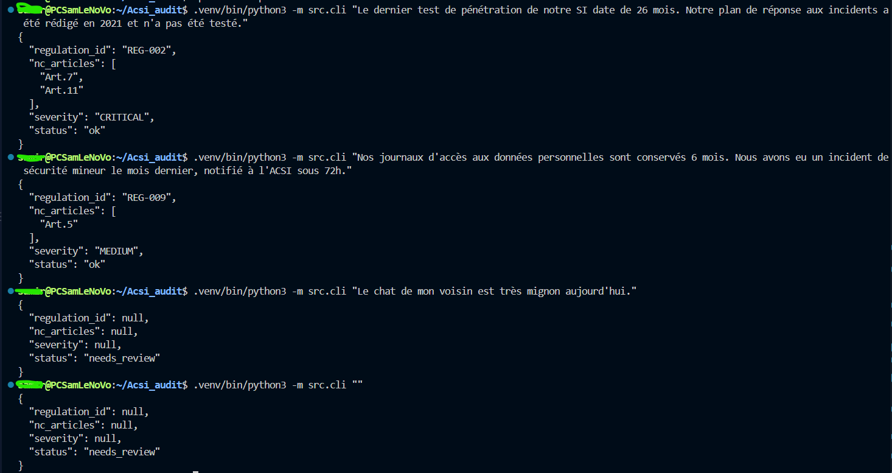

# Conformité Réglementaire | AuditPro MVP — Préparation de dossier d'audit

## Phase 1 : acsi-audit — vertical slice (Make it work)
En Input, Un extrait de texte décrivant une pratique d'une entité. 
En Output, Un règlement applicable, des articles potentiellement non conformes et une sévérité autrement le système refuse proprement s'il ne sait pas.

### Le besoin 

> Pour **l'auditeur ACSI en mission**, réduire **le temps passé à croiser manuellement un extrait de déclaration d'entité avec le bon règlement et ses articles** en produisant **une proposition de règlement applicable, d'articles à risque et de sévérité**, mesuré par **le taux de correspondance avec les qualifications retenues sur les cas connus** (`donnees/jeux_evaluation/eval_cases.csv`).

### Le contrat

- **Entrée** : un texte (`str`) — un extrait de déclaration, de constat d'auditeur ou de document.
- **Sortie** : `{"regulation_id": ..., "nc_articles": [...], "severity": ..., "status": ...}`
  - `regulation_id` : un des règlements actifs (`REG-001, 002, 003, 005, 006, 007, 008, 009, 010`) ou `null`
  - `severity` : `LOW | MEDIUM | HIGH | CRITICAL` ou `null`.
  - `status` : `ok` ou `needs_review`.
- **Refus** : si le texte est vide, ou si aucun règlement ne correspond à aucun mot-clé connu, `status` vaut `needs_review` et `regulation_id`/`nc_articles`/`severity` valent `null` — le système n'invente rien.

Le contrat est dans `src/classify.py`.

### Les trois cas (nominal, ambigu, invalide)

```bash
# Nominal — reprend EVAL-C2, correspondance exacte
.venv/bin/python3 -m src.cli "Le dernier test de pénétration de notre SI date de 26 mois. Notre plan de réponse aux incidents a été rédigé en 2021 et n'a pas été testé."
# -> REG-002, [Art.7, Art.11], CRITICAL, ok

# Ambigu — reprend EVAL-C6, notification « limite », deux règlements concurrents
.venv/bin/python3 -m src.cli "Nos journaux d'accès aux données personnelles sont conservés 6 mois. Nous avons eu un incident de sécurité mineur le mois dernier, notifié à l'ACSI sous 72h."
# -> REG-009, [Art.5], MEDIUM, ok (catégorie discutable : REG-005 serait aussi défendable)

# Invalide — hors périmètre, aucun mot-clé connu
.venv/bin/python3 -m src.cli "Le chat de mon voisin est très mignon aujourd'hui."
# -> null, null, null, needs_review

# Invalide — message vide
.venv/bin/python3 -m src.cli ""
# -> null, null, null, needs_review
```

## Installation et lancement

```bash
uv venv .venv
uv pip install -e . --python .venv/bin/python
cp .env.example .env   # aucune clé requise à ce stade — mocks uniquement

.venv/bin/python3 -m src.cli "votre extrait de texte ici"
.venv/bin/python3 scripts/measure_baseline.py
```

## Structure

```
acsi-audit/
├── .env.example         # template — aucune clé requise (mocks)
├── .gitignore
├── pyproject.toml       
├── uv.lock
├── donnees/             # données ACSI fournies
├── scripts/
│   └── measure_baseline.py   # mesure, hors du trajet src/
└── src/
    ├── cli.py            # point d'entrée
    ├── classify.py        # le contrat : orchestre + refuse
    ├── regulation_model.py # ML mocké : règlement applicable
    ├── llm_client.py       # LLM mocké : articles + sévérité
    └── config.py           # lecture des variables d'environnement
```


__________________________________________________________________________________
